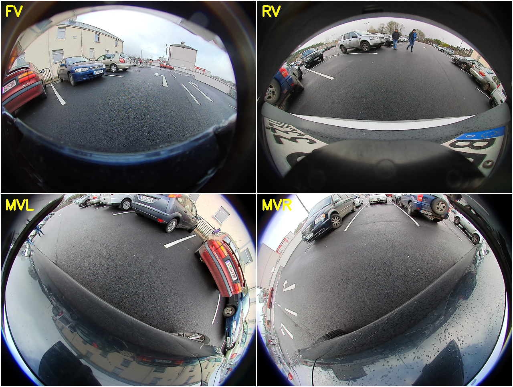
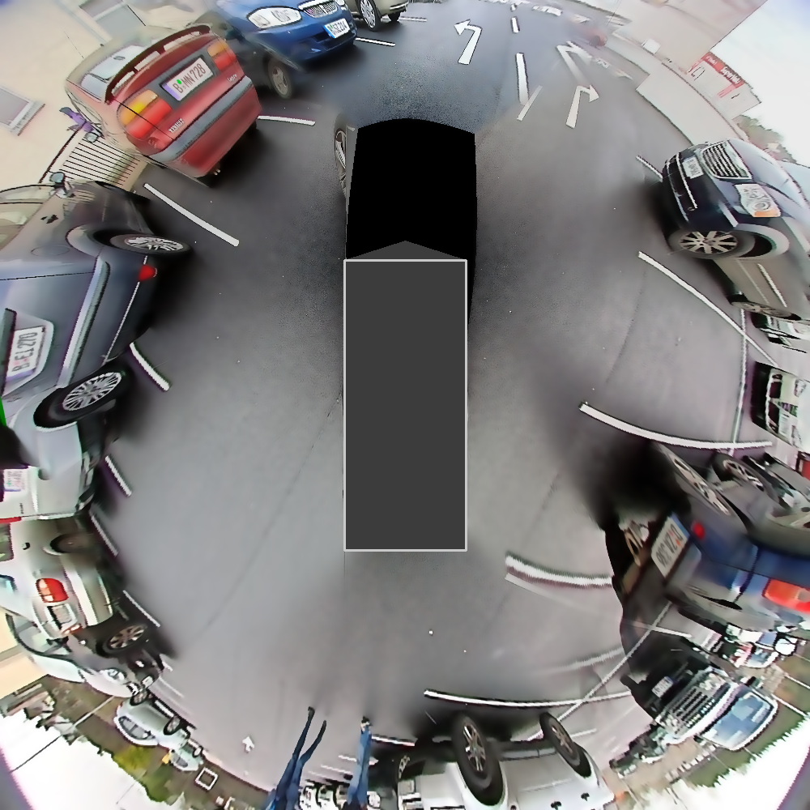
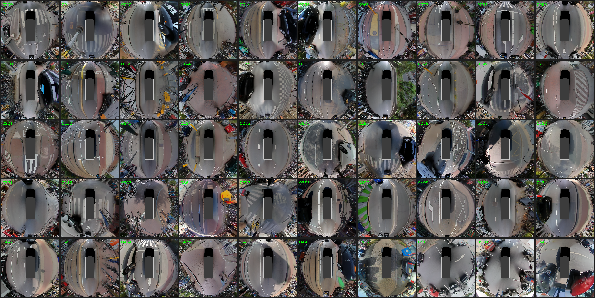
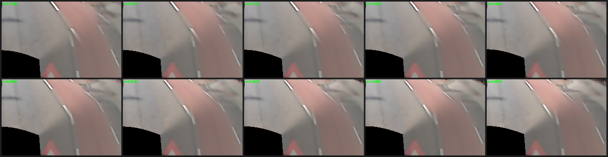
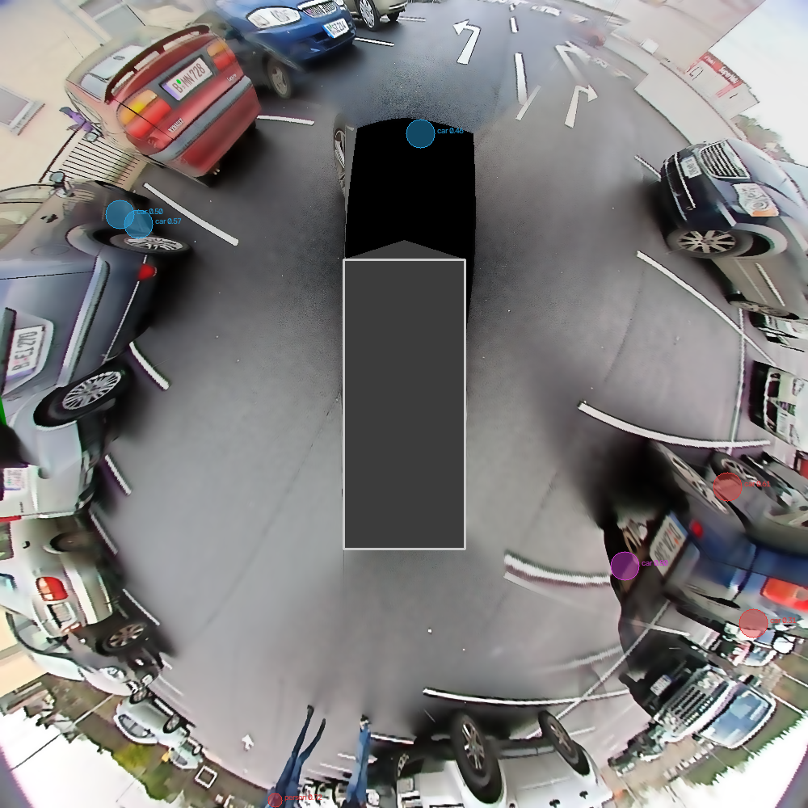
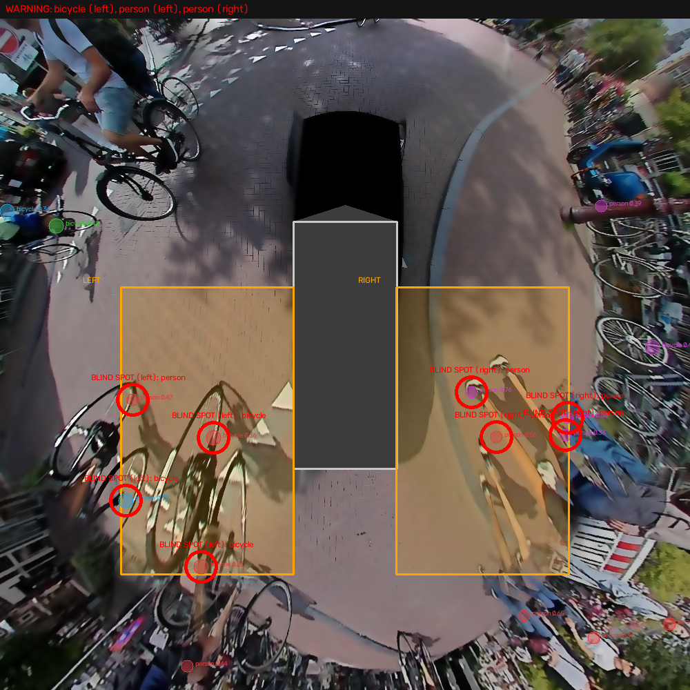
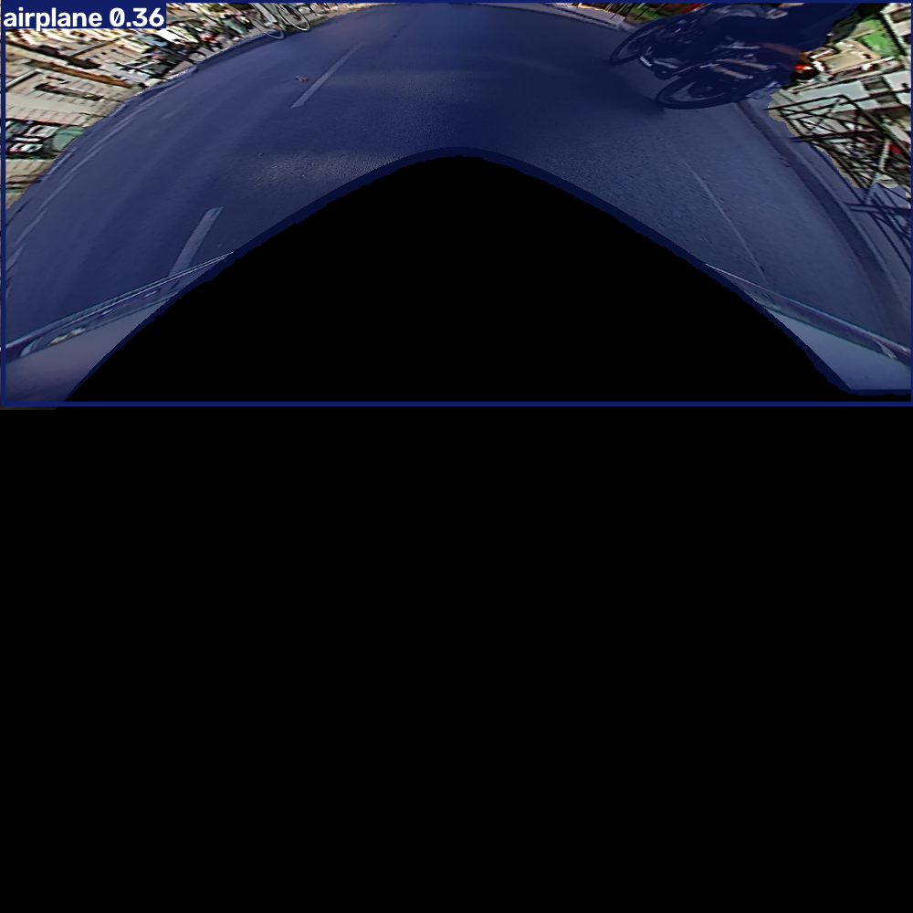
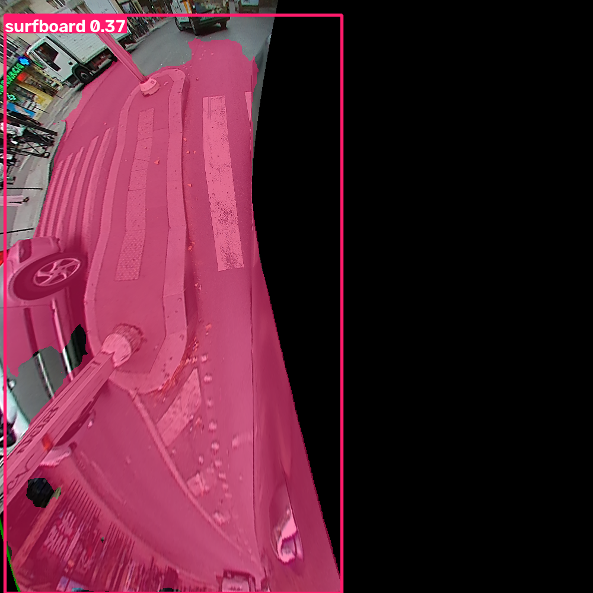
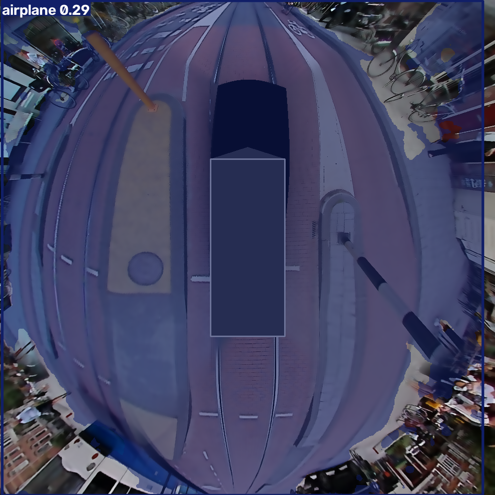
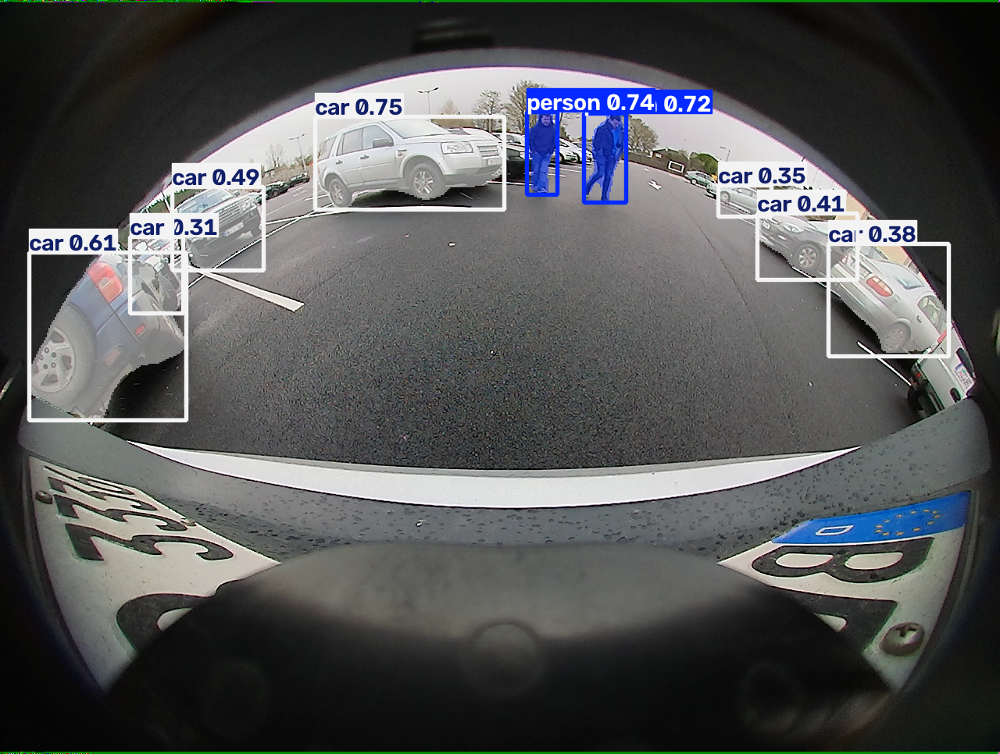

# WoodScape Surround-View Stitching & Blind-Spot Monitoring

Turns 4 fisheye cameras from the [WoodScape](https://github.com/valeoai/WoodScape)
dataset (front, rear, left-mirror, right-mirror) into a single 360° top-down
"parking camera" view, then adds a vehicle/pedestrian detection layer fused
into that same ground frame to drive a blind-spot warning demo — and along
the way, measures exactly where and why a standard object detector breaks
down at each stage of that pipeline.

See `CLAUDE.md` for the original project brief. This README is the visual
tour; `docs/` has the full technical write-up — every problem hit and
exactly how it was fixed, not just the final result.

## Table of contents

1. [What's here](#whats-here)
2. [Setup](#setup)
3. [The input: 4 fisheye cameras](#the-input-4-fisheye-cameras)
4. [Surround-view stitching](#surround-view-stitching)
5. [The front-camera seam problem](#the-front-camera-seam-problem)
6. [Object detection & ground fusion](#object-detection--ground-fusion)
7. [Blind-spot monitoring](#blind-spot-monitoring)
8. [Segmentation performance across the pipeline](#segmentation-performance-across-the-pipeline)
9. [Feature-matching technique shootout](#feature-matching-technique-shootout)
10. [Real-time camera pipeline](#real-time-camera-pipeline)
11. [Known limitations](#known-limitations)
12. [Read this next](#read-this-next)

## What's here

| Path | What it is |
|---|---|
| `src/` | Core, importable pipeline modules (stitching, detection fusion, blind-spot logic) |
| `scripts/` | Runnable batch/experiment drivers — each one is a `python3 scripts/<name>.py` entry point |
| `realtime/` | Live version of the same pipeline, fed by 4 GStreamer camera streams instead of dataset files — see below |
| `data/` | `manifest.json` + `sample_*.json` (verified synced frame subsets); `data/woodscape/` is the raw dataset (gitignored, see Setup) |
| `external/` | Cloned third-party repos this project depends on (gitignored, see Setup) |
| `models/` | Downloaded model weights (gitignored, auto-fetched on first run) |
| `outputs/` | Everything generated by running the scripts (gitignored — regenerate it yourself) |
| `docs/` | The full technical write-up, the two PDF reports, and the images in this README |
| `notebooks/` | Unrelated scratch notebook, kept out of the way |

## Setup

```bash
# Core pipeline
pip install -r requirements.txt

# Only needed for detection / blind-spot monitoring (YOLO) and the LoFTR
# matching technique -- large, recommended in its own virtualenv
pip install -r requirements-ml.txt
```

Fetch the third-party repos this project reuses rather than reimplements:

```bash
git clone https://github.com/valeoai/WoodScape.git external/WoodScape
git clone https://github.com/lwangvaleo/click_calib.git external/click_calib
```

Get the WoodScape dataset and place it at:

```
data/woodscape/
├── rgb_images/            00001_FV.png, 00001_RV.png, 00001_MVL.png, 00001_MVR.png, ...
├── calibration_data/      00001_FV.json, 00001_RV.json, 00001_MVL.json, 00001_MVR.json, ...
└── vehicle_data/rgb_images/   00001_FV.json, ... (per-frame timestamp + CAN data, used for sync)
```

The YOLO segmentation model (`models/yolo11n-seg.pt`) downloads
automatically the first time any detection script runs.

Every `scripts/*.py` file adds `src/` to `sys.path` itself and reads all
paths from `src/paths.py` (computed relative to the repo root) — nothing
is hardcoded to one machine, so this runs the same after a fresh
`git clone` as it did during development.

## The input: 4 fisheye cameras

Everything starts from 4 fisheye images taken at the *same* synchronized
instant — front, rear, left-mirror, right-mirror. Filenames aren't
synchronized across cameras in this dataset release, so frames are matched
by the `timestamp` field inside each camera's own metadata instead
(`scripts/batch_stitch.py` → `data/manifest.json`, 542 verified quadruples).



## Surround-view stitching

Rather than the classic "undistort, then warp with a homography" approach,
every ground point around the car is projected *forward* through each
camera's own calibration to ask "which pixel shows this point?", then
sampled with `cv2.remap`. All 4 cameras answer against the same shared
ground grid, so they come out pre-aligned — only the overlaps need
blending.



That single result took real iteration to get right — frame sync, a
resolution-collapse fix, brightness-matching between independently
auto-exposed cameras, masking out the car's own body, a curved "bowl"
projection surface instead of a flat one, and distance-weighted blending
to kill seam ghosting. All of it, plus what's still a known unfixable
limitation (anything not on the ground plane smears), is written up in
[`docs/surround_view_pipeline.md`](docs/surround_view_pipeline.md).

Run across a 50-frame sample, the result holds up consistently across a
real mix of scenes:



## The front-camera seam problem

The hardest single issue in this project: the front camera's seams against
the two mirror cameras looked visibly wrong — lane lines jumping sideways,
described at the time as "everything from the front looks scaled down and
nothing blends." Four independent automatic correction attempts (extrinsic
bias check, timing-drift check, three different 2D transform fits, and a
deep-learning feature matcher) all failed to find a consistent fix.

The eventual fix wasn't automatic at all: a fine sweep of the front
camera's intrinsic scale, visually compared frame by frame, until a value
(0.79) that actually looked right emerged — confirmed across the full
50-frame sample, not just the one seam crop that had been the test case
throughout:



Full post-mortem — including why the "obvious" automatic approaches didn't
work and why this metric-blind, vision-first fix was trusted anyway — is
in [`docs/surround_view_pipeline.md` §3.8](docs/surround_view_pipeline.md#38-the-front-camera-fv-seam--the-hard-one).

## Object detection & ground fusion

A pretrained YOLO11n-seg model (COCO classes, no fine-tuning) detects
vehicles and people. Critically, it runs on each camera's **raw** fisheye
image, not the stitched canvas — a detector trained on ordinary photos
falls apart on the flattened, height-smeared BEV image (measured: 97%
plausible detections on raw images vs. ~50-64% once flattened). Each
detection's ground-contact point is then back-projected through that same
camera's calibration to get a real (X, Y) position in vehicle-frame
meters, and only *that position* — never the pixels — gets combined across
cameras:



## Blind-spot monitoring

Two hand-defined zones alongside the car (the same footprint a real BSM
icon lights up for) get checked against every fused detection's ground
position. Anything inside gets circled and rolled into a warning banner.
22 of 50 sample frames trigger at least one warning, almost all correctly
— cyclists and pedestrians approaching from the rear-left/rear-right:



Zone definitions, the reasoning behind the ground-contact-point math, and
known limitations (no heading/velocity, occasional ego-body false
positives) are in [`docs/blind_spot_monitoring.md`](docs/blind_spot_monitoring.md).

## Segmentation performance across the pipeline

A 3-way controlled comparison: run the *same* detector on the same scenes
at 3 different points in the pipeline, to isolate exactly where and why
detection quality changes.

| Stage | What it is | Plausible detections | Frames with zero detections |
|---|---|---|---|
| 1. Raw | Straight off each camera | **97%** | 9.5% |
| 2. Calibrated, pre-stitch | One camera's own ground-projected patch, not yet blended | 58% | 50.5% |
| 3. Stitched | Final blended surround view | 64% | 52% |

Stage 2 — not stage 3 — turns out to be the worst. Each unblended
per-camera patch is mostly black (only that one camera's own valid wedge is
filled in), and the classifier reads the *silhouette* of that wedge as a
coherent object rather than reading what's inside it — front camera's arch
shape reads as "airplane," the left mirror's curved sliver reads as
"surfboard," in roughly half of all sample frames:

<table>
<tr>
<td></td>
<td></td>
</tr>
<tr>
<td align="center">Front camera patch → "airplane 0.36"</td>
<td align="center">Left-mirror patch → "surfboard 0.37"</td>
</tr>
</table>

The same shape-not-content failure shows up once cameras are blended too
— an early stitched result got the *entire canvas* labeled "airplane":



...compared to the raw camera it came from, where the same real objects
are detected correctly and with confidence:



Reproduce it: `scripts/experiment_yolo_seg_raw.py` (stage 1),
`scripts/experiment_yolo_seg_calibrated.py` (stage 2),
`scripts/experiment_yolo_seg.py` (stage 3).

## Feature-matching technique shootout

Before landing on the intrinsic-scale fix above, 5 correspondence-finding
techniques (template matching, SIFT, ECC, phase correlation, and the deep
learning-based LoFTR) were benchmarked against each other for the seam-
alignment problem, all plugged into the exact same downstream pipeline.
Full methodology, numbers, and charts: [`docs/feature_matching_performance_report.pdf`](docs/feature_matching_performance_report.pdf).

A beginner-friendly, diagram-first walkthrough of the entire project
(fisheye math, calibration, ground-plane projection, blending) is in
[`docs/surround_view_explainer.pdf`](docs/surround_view_explainer.pdf).

## Real-time camera pipeline

Everything above runs on pre-recorded dataset frames. `realtime/` is a
live version of the *same* pipeline — same ground-grid projection,
blending, detection fusion, and blind-spot zone logic, imported directly
from `src/` rather than duplicated — driven by 4 continuous GStreamer
camera feeds (UDP ports, one per camera) instead of files on disk.

It's a fully separate lane: nothing in `realtime/` edits `src/` or
`scripts/`, and nothing in the dataset pipeline depends on it. The one
shared change was a small, verified-behavior-preserving refactor to
`src/woodscape_surround_view.py` that split its blending step into its
own function (`blend_patches()`) so both the file-based batch pipeline and
the live one call exactly the same blend implementation instead of two
copies of it.

The capture mechanism (`realtime/gstreamer_capture.py`'s `LiveCameraFeed`)
was verified end-to-end against a real local GStreamer source — not just
written and left untested — confirming it actually opens a pipeline,
decodes frames, and always exposes the latest one to the stitching loop.
What's *not* verified here, because it depends entirely on hardware this
dev environment doesn't have: the exact video codec/format a real camera
rig sends (documented as configurable, defaulting to H.264-over-RTP), and
the real camera calibration files a real rig needs (a placeholder
`realtime/calibration/` folder is where those go).

Full setup, the port/codec/calibration assumptions, and the environment
split between GStreamer support and the YOLO/torch detection stack:
[`realtime/README.md`](realtime/README.md).

## Known limitations

- **Off-ground-plane smearing is fundamental, not fixed.** Anything not on
  the ground (cars, people, buildings) stretches radially — this is why
  detection runs on raw cameras, not the stitched image (see above).
- **A residual seam artifact remains** in some frames even after the
  intrinsic-scale fix. The recommended next step — not yet done — is
  [Click-Calib](https://github.com/lwangvaleo/click_calib) (already
  cloned into `external/click_calib/`, setup started but pending the
  manual point-clicking step).
- **No object tracking.** Detections are per-frame; a parked car and an
  approaching cyclist look identical to the blind-spot zone check.
- **Occasional false detections from the ego vehicle's own body** (hood,
  mirror) showing up as a nearby object.

## Read this next

- [`docs/surround_view_pipeline.md`](docs/surround_view_pipeline.md) — the
  stitching algorithm and every real problem solved on the way to a
  correct output.
- [`docs/blind_spot_monitoring.md`](docs/blind_spot_monitoring.md) — how
  per-camera detection gets fused into real ground positions and checked
  against blind-spot zones.
